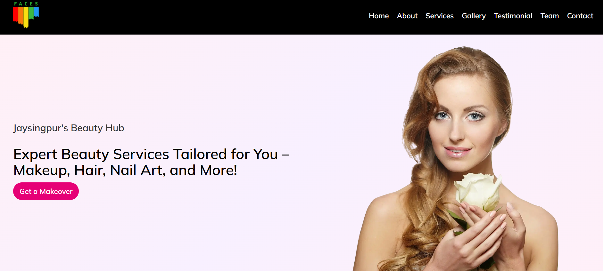
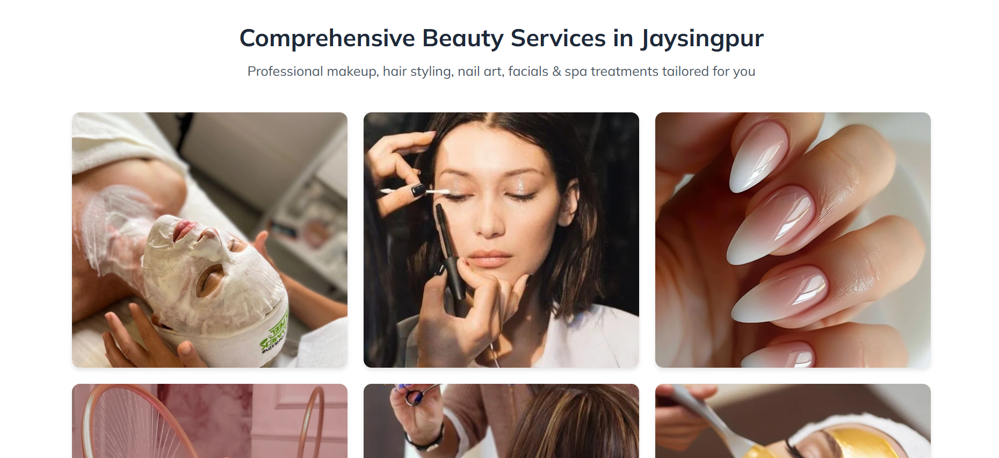
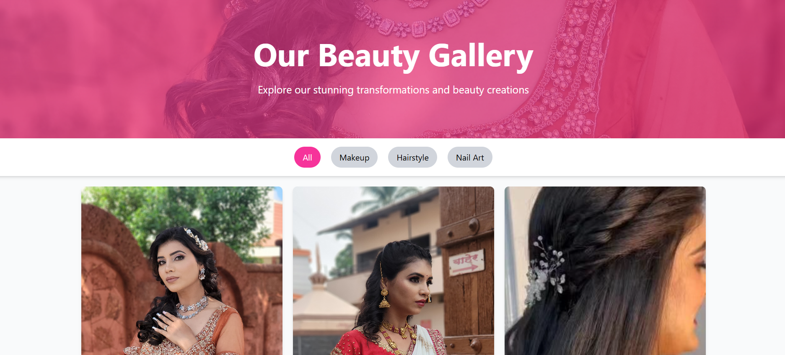
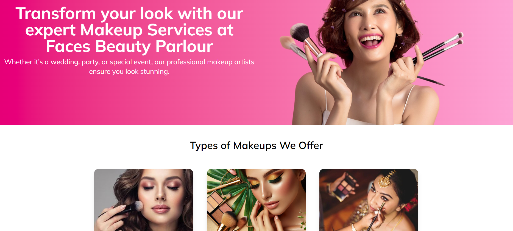

# 💇‍♀️ FACES Salon – Professional Beauty Services Website

Welcome to **FACES Salon**, a modern and elegant website built to showcase the services, style, and experience of a professional beauty salon.

🔗 **Live Site**: [facessalon.in](https://facessalon.in)

---

## 🛠️ Tech Stack

- **HTML5** – Structured content layout
- **Tailwind CSS / CSS3** – Sleek, mobile-friendly design
- **JavaScript** – Smooth interactivity and UI enhancements

---

## 🎯 Features

- ✨ Clean and responsive UI
- 📋 Service listings with details
- 🖼️ Gallery showcasing real salon photos
- 📍 Location & contact integration
- 📞 Call-to-action and appointment buttons
- 💅 Professional design with custom styling

---

## 📸 Screenshots

| Home Page | Services | Gallery | Service Page |
|----------|----------|---------|---------|
|  |  |  |  |

---

## 🤝 Collaboration

This website is custom-built for **FACES Salon** to support their digital presence and service promotion.  
If you're a business looking for a custom website, feel free to reach out!

---

## 🙋‍♂️ About the Developer

**Vivek Rokadi** and **Preetam Patil**– Passionate web developers and founders of **Nova Next**, delivering responsive and SEO-friendly web solutions for businesses and personal brands.

---

⭐ Star the repo if you like it  
🔧 Suggestions & contributions are welcome!

